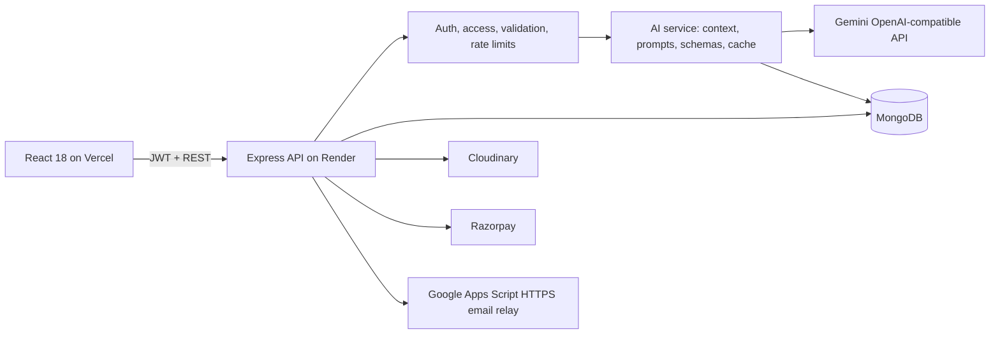

# StudyNotion

StudyNotion is a MERN EdTech application with a React 18/Create React App frontend and a CommonJS Express/Mongoose backend. It includes course creation and enrollment, Razorpay payments, JWT authentication, Cloudinary media, email workflows, and four server-side Gemini learning tools.

## Architecture



The browser never receives `GEMINI_API_KEY`. AI controllers load trusted course data on the server, remove video URLs and personal/payment data, cap context size, calculate a content hash, call Gemini through the OpenAI-compatible Chat Completions API, validate structured JSON with Zod, and persist only application results/history in MongoDB.

## Local installation

Requirements: Node.js 20, npm, MongoDB, and credentials for the integrations you want to exercise.

```bash
npm ci
npm --prefix server ci
copy .env.example .env
copy server\.env.example server\.env
npm run dev
```

Keep `.env` files local. The application’s non-AI features continue to run without `GEMINI_API_KEY`; AI generation endpoints return `503` with code `AI_NOT_CONFIGURED`.

### Frontend environment (Vercel)

| Variable | Required | Purpose |
| --- | --- | --- |
| `REACT_APP_BASE_URL` | Yes | Fresh Render API URL including `/api/v1`, for example `https://your-api.onrender.com/api/v1` |

### Backend environment (Render)

| Variable | Required | Purpose/default |
| --- | --- | --- |
| `CLIENT_URL` | Yes | Exact fresh Vercel origin; comma-separated origins are supported |
| `JWT_SECRET` | Yes | New high-entropy JWT signing secret |
| `MONGODB_URL` | Yes | Fresh MongoDB connection string |
| `GEMINI_API_KEY` | For AI | Server-only Gemini API key; missing key yields `AI_NOT_CONFIGURED` |
| `GEMINI_MODEL` | No | Defaults to `gemini-3.1-flash-lite` |
| `AI_REQUESTS_PER_HOUR` | No | Per-user AI limit; defaults to `30` |
| `GMAIL_APPS_SCRIPT_URL` | For email | Google Apps Script web-app `/exec` URL |
| `EMAIL_WEBHOOK_SECRET` | For email | High-entropy secret shared only by Render and Apps Script |
| `MAIL_FROM_NAME` | No | Sender display name; defaults to `StudyNotion` |
| `MAIL_REPLY_TO` | No | Optional reply-to address |
| `EMAIL_REQUEST_TIMEOUT_MS` | No | Gmail relay HTTPS request timeout; defaults to `15000` |
| `CLOUD_NAME` | For uploads | Cloudinary cloud name |
| `API_KEY` | For uploads | Cloudinary API key |
| `API_SECRET` | For uploads | Cloudinary API secret |
| `FOLDER_NAME` | For uploads | Cloudinary folder |
| `RAZORPAY_KEY` | For payments | Razorpay key ID |
| `RAZORPAY_SECRET` | For payments | Razorpay signing secret |
| `PORT` | No | Injected by Render; local default is `4000` |
| `NODE_ENV` | No | Render sets `production` |
| `SEED_DEMO_CATALOG` | No | Set to `true` to idempotently create the eight-course portfolio catalog at startup |

Never create a `REACT_APP_GEMINI_API_KEY` variable. CRA embeds every `REACT_APP_*` value into the browser bundle.

### Portfolio demo catalog

Set `SEED_DEMO_CATALOG=true` when this fresh deployment needs realistic sample
content. At startup the backend creates an approved, non-login demo instructor,
six categories, eight published courses, 24 sections, and 72 lessons. Course
artwork is served from `public/course-thumbnails`, and the catalog uses only
public Cloudinary sample videos already present in the configured cloud.

The seeder uses stable document identifiers and idempotent upserts, so repeated
deployments do not duplicate the demo content. It never modifies enrollments or
reviews on existing demo courses. Set the variable to `false` after the first
successful deployment if automatic reconciliation is no longer wanted.

### Free Gmail email relay

The backend sends OTP, password-reset, contact, and enrollment messages through
Google Apps Script over HTTPS. This avoids SMTP ports and does not require a
custom domain. The Gmail account that deploys the script becomes the sender.

1. Open [Google Apps Script](https://script.google.com/) with the Gmail account
   that should send StudyNotion messages and create a new project.
2. Replace the project contents with `google-apps-script/Code.gs` from this
   repository.
3. In **Project Settings → Script properties**, add
   `EMAIL_WEBHOOK_SECRET` with a new random value of at least 32 characters.
4. Select `authorizeEmailRelay` in the editor, click **Run**, and approve the
   requested send-email permission.
5. Choose **Deploy → New deployment → Web app**. Execute the app as **Me** and
   allow access to **Anyone**, then authorize the requested email permission.
6. Copy the deployment URL ending in `/exec` to Render as
   `GMAIL_APPS_SCRIPT_URL`. Add the same secret to Render as
   `EMAIL_WEBHOOK_SECRET`.
7. Keep `MAIL_FROM_NAME=StudyNotion` and set `MAIL_REPLY_TO` to the address that
   should receive replies. Never add these server credentials to Vercel.

Consumer Gmail and Apps Script accounts have daily sending quotas, so this
free relay is appropriate for a portfolio or low-volume deployment, not bulk
email.

## AI Learning Hub

- **Quiz Generator:** 5–15 Easy/Medium/Hard questions scoped to a course, section, or lesson. Correct answers remain server-side until a student submits; grading and explanations are returned afterward.
- **Course Summary:** structured overview, objectives, prerequisites, key points, section summaries, glossary, revision checklist, and study-time estimate. Results cache by course-content hash.
- **Doubt Solver:** private, bounded conversations grounded in the selected course scope. Returned citations are replaced with trusted server-loaded IDs/titles; unsupported answers are labeled clearly.
- **Learning Roadmap:** student-only plans based on real `CourseProgress`, level, goal, weekly hours, and optional target date. Referenced lessons are validated and weekly hours cannot exceed the submitted budget.

AI outputs are based on course and lesson titles/descriptions. Video transcripts are not currently ingested, so answers and summaries cannot cover information available only inside a video. AI output can be inaccurate and should be reviewed. API usage incurs Gemini API charges; configure rate limits and monitor usage before production rollout.

## API summary

All AI routes require authentication and per-user rate limiting.

| Method | Endpoint | Access |
| --- | --- | --- |
| `POST` | `/api/v1/ai/quiz/generate` | Enrolled student or owning instructor |
| `GET` | `/api/v1/ai/quiz/:quizId` | Quiz owner with current course access |
| `POST` | `/api/v1/ai/quiz/:quizId/submit` | Enrolled student/quiz owner |
| `POST` | `/api/v1/ai/summary/generate` | Enrolled student or owning instructor |
| `GET` | `/api/v1/ai/summary/:courseId` | Enrolled student or owning instructor |
| `POST` | `/api/v1/ai/conversations` | Enrolled student |
| `GET/DELETE` | `/api/v1/ai/conversations/:conversationId` | Conversation owner |
| `POST` | `/api/v1/ai/conversations/:conversationId/messages` | Conversation owner |
| `POST` | `/api/v1/ai/roadmap/generate` | Enrolled student |
| `GET` | `/api/v1/ai/roadmap/:courseId` | Enrolled student/roadmap owner |
| `DELETE` | `/api/v1/ai/roadmap/:roadmapId` | Roadmap owner |

Health checks are available at `/` and `/health`.

## Security and access rules

- Tokens are accepted only from an HTTP-only cookie or `Authorization: Bearer`; request-body JWTs are ignored.
- Public signup accepts only Student or Instructor. New instructors may sign in while pending, but approved-instructor routes remain blocked until an Admin changes their approval state through a trusted administrative process.
- Admins approve or revoke instructors with `PATCH /api/v1/auth/instructors/:userId/approval` and a boolean `approved` body.
- For a one-owner portfolio deployment, the owner can approve an instructor from a trusted machine whose `server/.env` points at production: `npm --prefix server run approve:instructor -- instructor@example.com`. The command never prints the database credential.
- Login, OTP, password reset, and AI endpoints are rate limited. OTPs are never returned or logged.
- Course/section/lesson mutations require an approved instructor who owns the entire parent chain. Full videos require enrollment or course ownership.
- Payment verification uses a stored immutable order containing user, course IDs, expected amount, and currency. Client course IDs/amounts are ignored after checkout, signatures are timing-safe, processed orders cannot be reused, and enrollment uses idempotent operations.
- CORS is restricted to `CLIENT_URL`; Helmet, request-size limits, ObjectId/input validation, and centralized safe error responses are enabled.
- Model prompts treat course text and questions as untrusted data. Provider errors, prompts, stack traces, secrets, emails, payment data, and Cloudinary video URLs are not sent to or returned from AI routes.

## Tests and verification

```bash
npm --prefix server run check
npm --prefix server test
npm run test:ci
npm run build
npm audit
npm --prefix server audit
```

Backend tests use `mongodb-memory-server` and mock the OpenAI SDK's Gemini-compatible client. They make no paid or external model requests.

## Fresh deployment

1. Create a new empty GitHub repository. Do not add the old repository as a remote. From this clean project, add only the new remote, review `git status`, then commit source files. `.env`, `node_modules`, `build`, coverage, logs, and temporary files are ignored.
2. Create a new MongoDB database/user and new credentials for JWT, Brevo transactional email, Cloudinary, and Razorpay as appropriate. Do not reuse values from an old test deployment.
3. In Render, create a new Blueprint/web service from the new repository using `render.yaml`. Enter every `sync: false` value. Initially set `CLIENT_URL` to the eventual Vercel origin; if Vercel is not created yet, update it immediately after step 4. Add `GEMINI_API_KEY` manually when ready.
4. In Vercel, create a new project from the new repository. Set `REACT_APP_BASE_URL` to the fresh Render URL plus `/api/v1` and deploy. The backend returns the public Razorpay Key ID with each order; the Razorpay secret remains server-only.
5. Update Render `CLIENT_URL` to the exact Vercel production origin (no path), redeploy Render, and confirm `/health`, signup/login, payment sandbox flow, course access, and each AI feature.
6. Leave Render automatic deploys disabled until the smoke test succeeds; enable them later if desired. Configure budget/rate alerts in Google AI Studio and payment-provider dashboards.

No deployment, push, remote connection, or commit is performed by this repository setup.
